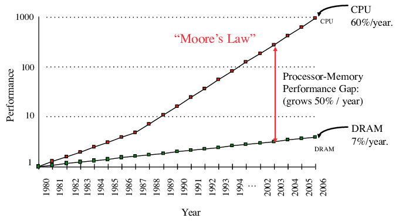

How long does it take to add two numbers together? Being one of the most frequently used instructions, `add` by itself only takes one cycle to execute. So, if the data is already loaded into registers, it takes one just cycle.

But in the general case (`*c = *a + *b`), we need to fetch its operands from memory first:

```nasm
mov eax, DWORD PTR [rsi]
add eax, DWORD PTR [rdi]
mov DWORD PTR [rdx], eax
```

<!--

When you fetch anything from memory, the request goes through an incredibly complex system of address translation units and caching layers, and if the data wasn't in any of them, the request proceeds off-chip to either temporary (RAM) or persistent (HDD, SSD) memory. This causes the total latency to be influenced by many factors such as and even [which part of the chip it is physically located](https://randomascii.wordpress.com/2022/01/12/5-5-mm-in-1-25-nanoseconds/).

-->

When you fetch anything from memory, there is always some latency before the data arrives. Moreover, the request doesn't go directly to its ultimate storage location, but it first goes through a complex system of address translation units and caching layers designed to both help in memory management and reduce latency.

Therefore, the only correct answer to this question is "it depends" — primarily on where the operands are stored:

- If the data is stored in the main memory (RAM), it will take around ~100ns, or about 200 cycles, to fetch it, and then another 200 cycles to write it back.
- If it was accessed recently, it is probably *cached* and will take less than that to fetch, depending on how long ago it was accessed — it could be ~50 cycles for the slowest layer of cache and around 4-5 cycles for the fastest.
- But it could also be stored on some type of *external memory* such as a hard drive, and in this case, it will take around 5ms, or roughly $10^7$ cycles (!) to access it.

Such a high variance of memory performance is caused by the fact that memory hardware doesn't follow the same [laws of silicon scaling](/hpc/complexity/hardware) as CPU chips do. Memory is still improving through other means, but if 50 years ago memory timings were roughly on the same scale with the instruction latencies, nowadays they lag far behind.



To be less of a limiting factor, modern memory systems are becoming increasingly [hierarchical](hierarchy), where the higher layers trade off some of their capacity for reduced latency. As these characteristics may change in the orders of magnitude between the layers — especially in the case of external memory types — it became crucial for many memory-intensive algorithms to optimize their I/O operations before anything else.

This prompted the creation of a new cost model, called the *external memory model*, whose only primitive operations are block reads and writes, and everything else has zero cost as long as it only involves data stored in a limited-sized local memory. It spawned an exciting new field of *external memory algorithms*, which we will study in this chapter.

<!--

It becomes ever more important to optimize

Modern computers grow ever more powerful, but their memory systems can't quite pick up with the increase in computing power, because they don't follow the same [laws of silicon scaling](/hpc/complexity/hardware) as CPU chips do.

If a CPU core has a frequency of 3 GHz, it roughly means that it is capable of executing up to $3 \cdot 10^9$ operations per second, depending on what constitutes an "operation." This is the baseline: on modern architectures, it can be increased by techniques such as SIMD and instruction-level parallelism up to $10^{11}$ operations per second, if the computation allows it.

But for many algorithms, the CPU is not the bottleneck. Before trying to optimize performance above that baseline, we need to learn not to drop below it, and the number one reason for this is memory.

-->
