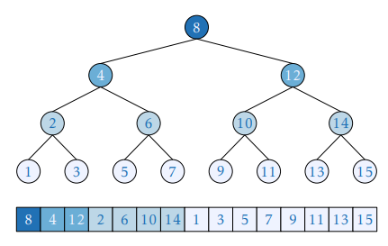

## Branchy Binary Search

Contains an "if" that is impossible to predict better than a coin flip:

```cpp
int lower_bound(int x) {
    int l = 0, r = n - 1;
    while (l < r) {
        int t = (l + r) / 2;
        if (a[t] >= x)
            r = t;
        else
            l = t + 1;
    }
    return a[l];
}
```

Also both temporal and spacial locality are terrible, but we address that later

----

This is actually how `std::lower_bound` works

```cpp
template<typename _ForwardIterator, typename _Tp, typename _Compare> _ForwardIterator
__lower_bound(_ForwardIterator __first, _ForwardIterator __last, const _Tp& __val, _Compare __comp) {
    typedef typename iterator_traits<_ForwardIterator>::difference_type _DistanceType;
    _DistanceType __len = std::distance(__first, __last);

    while (__len > 0) {
        _DistanceType __half = __len >> 1;
        _ForwardIterator __middle = __first;
        std::advance(__middle, __half);
        if (__comp(__middle, __val)) {
            __first = __middle;
            ++__first;
            __len = __len - __half - 1;
        }
        else
            __len = __half;
    }
    return __first;
}
```

[libstdc++ from GCC](https://github.com/gcc-mirror/gcc/blob/d9375e490072d1aae73a93949aa158fcd2a27018/libstdc%2B%2B-v3/include/bits/stl_algobase.h#L1023)

----

### Branch-Free Binary Search

It's not illegal: ternary operator is replaced with something like `CMOV` 

```cpp
int lower_bound(int x) {
    int base = 0, len = n;
    while (len > 1) {
        int half = len / 2;
        base = (a[base + half] >= x ? base : base + half);
        len -= half;
    }
    return a[base];
}
```

Hey, why not add prefetching? <!-- .element: class="fragment" data-fragment-index="1" -->

----

### Speculative Execution

* CPU: "hey, I'm probably going to wait ~100 more cycles for that memory fetch"
* "why don't I execute some of the later operations in the pipeline ahead of time?"
* "even if they won't be needed, I just discard them"

```cpp
bool cond = some_long_memory_operation();

if (cond)
    do_this_fast_operation();
else
    do_that_fast_operation();
```

*Implicit prefetching*: memory reads can be speculative too
$\implies$ reads will be pipelined anyway
<!-- .element: class="fragment" data-fragment-index="1" -->

(By the way, this is what Meltdown was all about)
<!-- .element: class="fragment" data-fragment-index="2" -->

---

## Cache Locality Problems

* First ~10 queries may be cached (frequently accessed: temporal locality)
* Last 3-4 queries may be cached (may be in the same cache line: data locality)
* But that's it. Maybe store elements in a more cache-friendly way?


Access frequency heatmap if queries were random

---

## Eytzinger Layout

<!-- .slide: id="eytzinger" -->
<style>
#eytzinger {
  font-size: 20px;
}
</style>

* **Michaël Eytzinger** is a 16th century Austrian nobleman known for his work on genealogy
* Ancestry mattered a lot back then, but writing down and storing that data was expensive
* He came up with *ahnentafel* (German for "ancestor table"), a system for displaying a person's direct ancestors compactly in a fixed sequence of ascent


*Thesaurus principum hac aetate in Europa viventium Cologne, 1590*

----

Ahnentafel works like this:
* First, the person theirself is listed as number 1
* Then, recursively, for each person numbered $k$:
   * their father is listed as $2k$ 
   * their mother is listed as $(2k+1)$

----

Here is the example for Paul I, the great-grandson of Peter I, the Great:

1. Paul I
2. Peter III (Paul’s father)
3. Catherine II (Paul’s mother)
4. Charles Frederick (Peter’s father, Paul’s paternal grandfather)
5. Anna Petrovna (Peter’s mother, Paul’s paternal grandmother)
6. Christian August (Catherine’s father, Paul’s maternal grandfather)
7. Johanna Elisabeth (Catherine’s mother, Paul’s maternal grandmother)

Apart from being compact, it has some nice properties, for example:
<!-- .element: class="fragment" data-fragment-index="1" -->
* Ancestors are sorted by "distance" from the first person <!-- .element: class="fragment" data-fragment-index="2" -->
* All even-numbered persons $>1$ are male and all odd-numbered are female <!-- .element: class="fragment" data-fragment-index="3" -->
* You can find the number of an ancestor knowing their descendants' genders <!-- .element: class="fragment" data-fragment-index="4" -->

Example: Peter the Great's bloodline is:
Paul I → Peter III → Anna Petrovna → Peter the Great,
so his number should be $((1 \times 2) \times 2 + 1) \times 2 = 10$
<!-- .element: class="fragment" data-fragment-index="5" -->

---

## Back to Computer Science

This enumeration has been widely used for implicit ("pointer-free") implementations of heaps, segment trees, and other binary tree structures


This is how this layout looks when applied to binary search

Important note: *it begins with 1 and not 0*
<!-- .element: class="fragment" data-fragment-index="1" -->

----


Temporary locality is way better

----

## Construction

You could build it by traversing and remapping the original search tree

```cpp
const int n = 1e5;
int a[n], b[n+1];

int eytzinger(int k = 1) {
    static int i = 0; // <- carefull when invoking multiple times
    if (k <= n) {
        eytzinger(2 * k);
        b[k] = a[i++];
        eytzinger(2 * k + 1);
    }
}
```

Notice that the order in which we exit nodes is just array elements themself,
so we can just copy elements on exit and not calculate $l$ and $r$

---

## Searching

Same as in binary search, but instead of ranges start with $k=1$ and execute:
* $k := 2k$ if we need to go left
* $k := 2k + 1$ if we need to go right

The only problem arises when we need to restore the index of the resulting element,
as $k$ may end up not pointing to a leaf node
<!-- .element: class="fragment" data-fragment-index="1" -->

----

<!-- .slide: id="searching" -->
<style>
#searching pre {
    width: 410px;
}
</style>

Example: querying array of of $[1, …, 8]$ for the lower bound of $x=4$
(we end up with $k=11$ which is not even a valid index)

```
    array:  1 2 3 4 5 6 7 8
eytzinger:  4 2 5 1 6 3 7 8
1st range:  ---------------  k := 1
2nd range:  -------          k := 2*k      (=2)
3rd range:      ---          k := 2*k + 1  (=5)
4th range:        -          k := 2*k + 1  (=11)
```

* Unless the answer is the last element, we compare $x$ against it at some point
* After we learn that $ans \geq x$, we start comparing $x$ against elements to the left
* All these comparisons will evaluate true ("leading to the right")
* $\implies$ We need to "cancel" some number of riht turns
<!-- .element: class="fragment" data-fragment-index="1" -->

----

* The right turns are recorded in the binary notation of $k$ as 1-bits
* We just need to find the number of trailing ones in the binary notation
  and right-shift $k$ by exactly that amount
* To do it, invert the bits of $k$ and use "find first set" instruction on it

```cpp
int search(int x) {
    int k = 1;
    while (k <= n) {
        if (b[k] >= x)
            k = 2 * k;
        else
            k = 2 * k + 1;
    }
    k >>= __builtin_ffs(~k);
    return b[k];
}
```

Note that $k$ will be zero if binary search returned no result
(all turns were right-turns and got canceled)

---

## Optimization: Branch-Free

Inner "if-else":

```cpp
while (k <= n) {
    if (b[k] >= x)
        k = 2 * k;
    else
        k = 2 * k + 1;
}
```

...can be easily rewritten to:

```cpp
while (k <= n)
    k = 2 * k + (b[k] < x);
```

Apart from mitigating branch mispredictions,
it also directly saves us a few arithmetic instructions

---

## Optimization: Prefetching

Let me just dump this line of code and then explain why it works so well:

```cpp
const int block_size = 64 / 4; // the number of elements that fit into one cache line (16 for ints)
while (k <= n) {
    __builtin_prefetch(b + k * block_size);
    k = 2 * k + (b[k] < x);
}
```

What is happening? What is $k \cdot B$?

It is $k$'s grand-grand-grandfather!
<!-- .element: class="fragment" data-fragment-index="1" -->

----

* When we fetch $k * B$, *if it is on the beginnigng of a cache line*,
  we also cache next $B$ elements, all of which happe to be our grand-grand-grandfathers too
* As i/o is pipelined, we are always prefetching 4 levels in advance
* We are trading off bandwidth for latency <!-- .element: class="fragment" data-fragment-index="1" -->


*Latency-bandwith product* must be $\geq 4$ to do that (on most computers, it is)
<!-- .element: class="fragment" data-fragment-index="1" -->

----

### Memory Alignment

Minor detail: for all this to work we need to start at 2nd position of a cache line

```cpp
alignas(64) int b[n+1];
```

This way, we also fetch all 4 first levels (1+2+4+8=15 elements) on the first read

---

## Final Implementation

```cpp
const int n = (1<<20);
const int block_size = 16; // = 64 / 4 = cache_line_size / sizeof(int)
alignas(64) int a[n], b[n+1];

int eytzinger(int k = 1) {
    static int i = 0;
    if (k <= n) {
        eytzinger(2 * k);
        b[k] = a[i++];
        eytzinger(2 * k + 1);
    }
}

int search(int x) {
    int k = 1;
    while (k <= n) {
        __builtin_prefetch(b + k * block_size);
        k = 2 * k + (b[k] < x);
    }
    k >>= __builtin_ffs(~k);
    return k;
}
```

(yes, it's just 15 lines of code)

---

## B-trees

* Idea: store $B$ keys in each "node", where $B$ is exactly the block size
* In external memory model, doing $B$ comparisons costs the same as doing one
* This allows branching factor of $(B+1)$ instead of $2$


----

### Layout

Exact layout of blocks doesn't really matter, because we fetch the whole block anyway

```cpp
const int nblocks = (n + B - 1) / B;
alignas(64) int btree[nblocks][B];

// helper function to get i-th child of node k
int go(int k, int i) {
    return k * (B + 1) + i + 1;
}
```

----

### Building

Very similar to `eytzinger`, just generalized over $B+1$ children:

```cpp
void build(int k = 0) {
    static int t = 0;
    if (k < nblocks) {
        for (int i = 0; i < B; i++) {
            build(go(k, i));
            btree[k][i] = (t < n ? a[t++] : INF);
        }
        build(go(k, B));
    }
}
```

----

### Searching 

```cpp
int search(int x) {
    int k = 0, res = INF;
    start: // the only justified usage of the goto statement
           // as doing otherwise would add extra inefficiency and more code
    while (k < nblocks) {
        for (int i = 0; i < B; i++) {
            if (btree[k][i] >= x) {
                res = btree[k][i];
                k = go(k, i);
                goto start;
            }
        }
        k = go(k, B);
    }
    return res;
}
```

---

## Single Instruciton, Multiple Data

Remember talk about superscalar execution?
SIMD is like if we had multiple ALUs:


As the name suggests, it allows performing the same operation on multiple data points
(blocks of 128, 256 or 512 bits)

*This is the sole topic of the next lecture, stay tuned*
<!-- .element: class="fragment" data-fragment-index="1" -->

----

Let's rewrite comparison part in a data-parallel fashion:

```cpp
int mask = (1 << B);
for (int i = 0; i < B; i++)
    mask |= (btree[k][i] >= x) << i;
int i = __builtin_ffs(mask) - 1;
// now i is the number of the correct child node
```

Here is how it looks with SIMD:
<!-- .element: class="fragment" data-fragment-index="1" -->

```cpp
// SIMD vector type names are weird and tedious to type, so we define an alias
typedef __m256i reg;

// somewhere in the beginning of search loop:
reg x_vec = _mm256_set1_epi32(x);

int cmp(reg x_vec, int* y_ptr) {
    reg y_vec = _mm256_load_si256((reg*) y_ptr);
    reg mask = _mm256_cmpgt_epi32(x_vec, y_vec);
    return _mm256_movemask_ps((__m256) mask);
}
```
<!-- .element: class="fragment" data-fragment-index="1" -->

----

## Final Version

```cpp
int search(int x) {
    int k = 0, res = INF;
    reg x_vec = _mm256_set1_epi32(x);
    while (k < nblocks) {
        int mask = ~(
            cmp(x_vec, &btree[k][0]) +
            (cmp(x_vec, &btree[k][8]) << 8)
        );
        int i = __builtin_ffs(mask) - 1;
        if (i < B)
            res = btree[k][i];
        k = go(k, i);
    }
    return res;
}
```

Cache line size is twice as large as SIMD registers on most CPUs (512 vs 256),
so we call `cmp` twice and blend results 

---

## Analysis

* Assume all arithmetic is free, only consider i/o
* The Eytzinger binary search is supposed to be $4$ times faster if compute didn't matter, as it reads are ~4 times faster on average <!-- .element: class="fragment" data-fragment-index="1" -->
* The B-tree makes $\frac{\log_{17} n}{\log_2 n} = \frac{\log n}{\log 17} \frac{\log 2}{\log n} = \frac{\log 2}{\log 17} \approx 0.245$ memory access per each request of binary search, i. e. it needs ~4 times less cache lines to fetch <!-- .element: class="fragment" data-fragment-index="2" -->
* So when bandwidth is not a bottleneck, they are more or less equal <!-- .element: class="fragment" data-fragment-index="3" -->


This tutorial is loosely based on a [46-page paper](https://arxiv.org/pdf/1509.05053.pdf) by Paul-Virak Khuong and Pat Morin "Array layouts for comparison-based searching" and describes one particular way of performing efficient binary search by rearranging elements of a sorted array in a cache-friendly way.

We briefly review relevant concepts in processor architecture; if you want to get deeper, we recommend reading the original 2015 paper, as well as these articles:

* [Modern Microprocessors: a 90-minute guide](http://www.lighterra.com/papers/modernmicroprocessors/) by Jason Patterson

* [Cache-Oblivious Algorithms and Data Structures](https://erikdemaine.org/papers/BRICS2002/paper.pdf) by Erik Demaine

* [What Every Programmer Should Know About Memory](https://people.freebsd.org/~lstewart/articles/cpumemory.pdf) by Ulrich Drepper

Our minimalistic implementation is only ~15 lines of code while offering 4-5x speedup over `std::lower_bound`. The exact speedup depends a lot on available memory bandwidth (see notes below).

**If you are writing a contest right now**, stuck on a problem where binary search is a bottleneck, and suddenly remembered about this article, **jump straight to "complete implementation"**, it's compilable and copy-pastable.

## Why is binary search slow?

Here is a standard way of searching for the first element not less than $x$ in a sorted array:

```cpp
int lower_bound(int x) {
    int l = 0, r = n - 1;
    while (l < r) {
        int t = (l + r) / 2;
        if (a[t] >= x)
            r = t;
        else
            l = t + 1;
    }
    return a[l];
}
```

The running time of this (or any) algorithm is not just the "cost" of all its arithmetic operations, but rather this cost *plus* the time spent waiting for data to be fetched from memory. Thus, depending on the algorithm and problem limitations, it can be CPU-bound or memory-bound, meaning that the running time is dominated by one of its components.

If array is large enough—usually around the point where it stops fitting in cache and fetches become significantly slower—the running time of binary search becomes dominated by memory fetches.

To give an idea, the following code is only ~5% slower for $n \approx 10^6$:

```cpp
int slightly_slower_lower_bound(int x) {
    int l = 0, r = n - 1;
    while (l < r) {
        volatile int s = 0; // volatile to prevent compiler from cutting this code out
        for (int i = 0; i < 10; i++)
            s += i;
        int t = (l + r) / 2;
        if (a[t] >= x)
            r = t;
        else
            l = t + 1;
    }
    return a[l];
}
```

To be more precise about it, we briefly explain how memory fetching works.

## How caching works

Here is a famous quote about caching:


The reality is much more complicated, e. g. main memory has pagination and HDD is actually a rotating physical thing with weird access patterns, but we stick to this analogy and introduce some important entities to it:

* **Cache hierarchy** is a memory architecture which uses a hierarchy of memory stores based on varying access speeds to cache data. Adjacent cache layers usually differ in size by a factor of 8 to 10 and in latency by a factor of 3 to 5. Most modern CPUs have 3 layers of cache (called L1, L2 and L3 from fastest / smallest to slowest / largest) with largest being a few megabytes large.

* **Cache line** is the unit of data transfer between CPU and main memory. The cache line of your PC is most likely 64 bytes, meaning that the main memory is divided into blocks of 64 bytes, and whenever you request a byte, you are also fetching its cache line neighbours regardless whether your want it or not. *Fetching a cache line is like grabbing a 6-pack.*

* **Eviction policy** is the method for deciding which data to retain in the cache. In CPUs, it is controlled by hardware, not software. For simplicity, programmer can assume that **least recently used (LRU)** policy is used, which just evicts the item that hasn't been used for the longest amount of time. *This is like preferring beer with later expiration dates.*

* **Bandwidth** is the rate at which data can be read or stored. For the purpose of designing algorithms, a more important characteristic is the **bandwidth-latency product** which basically tells how many cache lines you can request while waiting for the first one without queueing up. It is around 5 or more on most systems. *This is like having friends whom you can send for beers asynchronously.*

* **Temporal locality** is an access pattern where if at one point a particular item is requested, it is likely that this same location will be requested again in the near future. *This is like fetching the same type of beer over and over again.*

* **Spacial locality** is an access pattern where if a memory location is requested, it is likely that a nearby memory locations will be requested again in the near future. *This is like storing the kinds of beer that you like on the same shelf.*

The main problem with binary search over a sorted array is that its memory accesses pattern is neither temporary nor spacially local. For example, element $\lfloor \frac n 2 \rfloor$ is accessed very often (every search) and element $\lfloor \frac n 2 \rfloor + 1$ is not, while they are probably occupying the same cache line. In general, only the first 3-5 reads are temporary local and only the last 3-4 reads are spacially local, and the rest are just random memory accesses.

We can overcome this by enumerating and permuting array elements in a more cache-friendly way. The numeration we will use is actually half a millenium old, and chances are you already know it.

## The Eytzinger layout

**Michaël Eytzinger** is a 16th century Austrian nobleman known for his work on genealogy, particularily for a system for numbering ancestors called *ahnentafel* (German for "ancestor table").

Ancestry mattered a lot back then, but writing down that data was expensive. *Ahnentafel* allows displaying a person's genealogy compactly, without wasting extra space by drawing diagrams.

It lists a person's direct ancestors in a fixed sequence of ascent. First, the person theirself is listed as number 1, and then, recursively, for each person numbered $k$, their father is listed as $2k$ and their mother as $(2k+1)$.

Here is the example for Paul I, the great-grandson of Peter I, the Great:

1. Paul I

2. Peter III (Paul's father)

3. Catherine II (Paul's mother)

4. Charles Frederick (Peter's father, Paul's paternal grandfather)

5. Anna Petrovna (Peter's mother, Paul's paternal grandmother)

6. Christian August (Catherine's father, Paul's maternal grandfather)

7. Johanna Elisabeth (Catherine's mother, Paul's maternal grandmother)

Apart from being compact, it has some nice properties, like that all even-numbered persons are male and all odd-numbered (possibly apart from 1) are female.

One can also find the number of a particular ancestor only knowing the genders of their descendants. For example, Peter the Great's bloodline is Paul I → Peter III → Anna Petrovna → Peter the Great, so his number should be $((1 \times 2) \times 2 + 1) \times 2 = 10$.

**In computer science**, this enumeration has been widely used for implicit (i. e. pointer-free) implementation of heaps, segment trees, and other binary tree structures, where instead of names it stores underlying array items.

This is how this layout will look when applied to binary search:



You can immediately see how its temporal locality is better (in fact, theoretically optimal) as the elements closer to the root are closer to the beginning of the array, and thus are more likely to be fetched from cache.

### Construction

Here is a function that constructs Eytzinger array by traversing the original search tree. 

It takes two indexes $i$ and $k$—one in the original array and one in constructed—and recursively goes to two branches until a leaf node is reached, which could simply be checked by asserting $k \leq n$ as Eytzinger array should have same number of items.

```cpp
const int n = 1e5;
int a[n], b[n+1];

int eytzinger(int i = 0, int k = 1) {
    if (k <= n) {
        i = eytzinger(i, 2 * k);
        b[k] = a[i++];
        i = eytzinger(i, 2 * k + 1);
    }
    return i;
}
```

Despite being recursive, this is actually a really fast implementation as all memory reads are sequential.

Note that the first element is left unfilled and the whole array is essencially 1-shifted. This will actually turn out to be a huge performance booster.

## Binary search implementation

We can now descend this array using only indices: we just start with $k=1$ and execute $k := 2k$ if we need to go left and $k := 2k + 1$ if we need to go right. We don't even need to store and recalculate binary search boundaries anymore.

The only problem arises when we need to restore the index of the resulting element, as $k$ may end up not pointing to a leaf node. Here is an example of how that can happen:

```python
    array:  1 2 3 4 5 6 7 8
eytzinger:  4 2 5 1 6 3 7 8
1st range:  ---------------  k := 1
2nd range:  -------          k := 2*k      (=2)
3rd range:      ---          k := 2*k + 1  (=5)
4th range:        -          k := 2*k + 1  (=11)
```

Here we query array of $[1, …, 8]$ for the lower bound of $x=4$. We compare it against $4$, $2$ and $5$, and go left-right-right and end up with $k = 11$, which isn't even a valid array index.

Note that, unless the answer is the last element of the array, we compare $x$ against it at some point, and after we learn that it is not less than $x$, we start comparing $x$ against elements to the left, and all these comparisons will evaluate true (i. e. leading to the right). Hence, the solution to restoring the resulting element is to cancel some number of right turns.

This can be done in an elegant way by observing that the right turns are recorded in the binary notation of $k$ as 1-bits, and so we just need to find the number of trailing ones in the binary notation and right-shift $k$ by exactly that amount.

To do this we can invert the number (`~x`) and call "find first set" instruction available on most systems. In GCC, the corresponding builtin is `__builtin_ffs`.

```cpp
int search(int x) {
    int k = 1;
    while (k <= n) {
        if (b[k] >= x)
            k = 2 * k;
        else
            k = 2 * k + 1;
    }
    k >>= __builtin_ffs(~k);
    return b[k];
}
```

Note that $k$ will be zero if binary search returned no result (i. e. all elements are less than $x$ and all turns were right-turns that got canceled). In that case, you can put a special flag in the first element of `b`.

This is already 2-3 times faster than `std::lower_bound`, but we are not going to stop there and apply a series of small incremental improvements.

### Branch-free

Compiled program instructions are stored and loaded from main memory too, just as normal data. They are fetched during execution by similar mechanisms, and they have a separate instruction cache. In fact, in large applications you can sometimes remove blocks of literally unused code, and the program may run faster because of better instruction cache hit rate, but this is a topic for another article.

To avoid performance hits caused by memory latency here, CPU loads 20-ish instructions ahead of time, but to do this it needs to know ahead of time which instructions to fetch. If a program has conditional execution (if-s, while-s, for-s) there is no option other than to take a guess.

Branch misprediction (guessing "wrong" branch of "if") costs around 10-20 cycles. To partially negate this penalty, hardware [branch predictors](https://en.wikipedia.org/wiki/Branch_predictor) were developed. These are complex ad-hoc systems that use statistical methods—some even use simple [neural networks](https://en.wikipedia.org/wiki/Branch_predictor#Neural_branch_prediction)—to make a more accurate guess.

In case of binary search, if all of our data is random, branch prediction doesn't help at all, just because it can't: all comparisons are 50-50. This is why we need to get rid of if-s and rewrite our main loop the following way:

```cpp
while (k <= n)
    k = 2 * k + (b[k] < x);
```

It also directly saves us from executing a few unnecessary arithmetic instructions.

### Prefetching

Compiler doesn't like when CPU is sitting idle while waiting for memory fetches. Sometimes it can take a guess about which cache line is going to be needed soon and fetch it ahead of time (recall that bandwidth-latency product is usually much larger than 1).

This works well for simple access patterns, like iterating over array in increasing or decreasing order, but for something complex like what we have here it's not going to perform well.

As we know a bit more about our problem than the compiler does, we can explicitly tell it to prefetch a cache line we need. This is done by `__builtin_prefetch` in GCC:

```cpp
while (k <= n) {
    __builtin_prefetch(b + k * block_size);
    k = 2 * k + (b[k] < x);
}
```

Here, `block_size` equals 16, which is precisely how many ints are needed to cover a cache line. When we reference cache line at `b + k * block_size`, we are referencing $k$'s grand-grandson (`block_size` = $2 \times 2 \times 2 \times 2$, or 4 left turns) and possibly some of his neighbours in his layer (recall that indexes at the same level are just consecutive numbers).

The whole point of doing this is that there is a good chance that we will prefetch an element that we will use later on $(i+4)$-th iteration. What chance, exactly? Well, it turns out that it is constant for each iteration.

### Memory allignment

Note that for each layer in the tree, except for the first 4 and possibly the last one, the number of nodes in that layer is divisible by 16, the block size. This means that the fraction of covered nodes on *each* iteration depends only on the position of the first offset of the array in respect to its cache line. But what is more important is that it can be made that all of $k$'s grand-grandchildren are covered by the same cache line.

The way to achieve this is to place the first element of the array to the 1st position (0-indexed) of a cache line, or placing the array itself on the beginning of a cache line, since its first (i. e. `b[0]`) element is blank by design. This way the next $1 + 2 + 4 + 8 = 15$ elements of first 4 layers will occupy the rest of the cache line, and the rest of the array is alligned in nice 16-element blocks of nodes that share a grandpa.

We just need to ask memory manager to allocate our array on the beginning of a cache line (by default it allocates your arrays wherever it wants), and that's it. To do this, we can use `alignas` specifier:

```cpp
alignas(64) int b[n+1];
```

This is it. Now our algorithm is constantly prefetching 4 layers / cache lines ahead of time, which is covered by the bandwidth of our RAM. This way the effective latency is reduced by a factor of 4, and we're basically trading off bandwidth for latency.

### Complete implementation

```cpp
#pragma GCC optimize("O3")
#include <bits/stdc++.h>

using namespace std;

const int n = (1<<20);
const int block_size = 16; // = 64 / 4 = cache_line_size / sizeof(int)
alignas(64) int a[n], b[n+1];

int eytzinger(int i = 0, int k = 1) {
    if (k <= n) {
        i = eytzinger(i, 2 * k);
        b[k] = a[i++];
        i = eytzinger(i, 2 * k + 1);
    }
    return i;
}

int search(int x) {
    int k = 1;
    while (k <= n) {
        __builtin_prefetch(b + k * block_size);
        k = 2 * k + (b[k] < x);
    }
    k >>= __builtin_ffs(~k);
    return k;
}
```

Few more things to note:

* It works best when $n$ is a power of 2 or close to it, because otherwise the branch predictor will have a hard time figuring out whether or not to unroll the $(\log n)$-th cycle.

* Its performance varies by cache size and array length, but stays >3x even on smaller arrays (<1MB).

* Preprocessing isn't costly. It is around 1% of the cost of firing the same number of queries as the array size.

* Modern hardware won't penalize you for prefetching cache lines that aren't yours, though this maybe be an issue for older CPUs, which can be solved by a simple `if` statement.

* For some reason, basic binary search implementation (the very first code block in this article) is already ~20% faster than `std::sort`.

## What about B-trees?

B-trees are basically $(k+1)$-ary trees, meaning that they store $k$ elements in each node and choose between $(k+1)$ possible branches instead of 2.

They are widely used for indexing in databases, especially those that operate on-disk, because if $k$ is big, this allows large sequential memory accesses while reducing the height of the tree.

To perform static binary searches, one can implement a B-tree in an implicit way, i. e. without actually storing any pointers and spending only $O(1)$ additional memory, and $k$ could be made equal to the cache line size so that each node request fetches exactly one cache line.


Turns out, they have the same rate of growth but sligtly larger compute-tied constant. While the latter is explainable (our while loop only has like 5 instructions; can't outpace that), the former is surprising.

Let's assume that arithmetic costs nothing and do simple cache block analysis:

* The Eytzinger binary search is supposed to be $4$ times faster if compute didn't matter, as it requests them ~4 times faster on average.

* The B-tree makes $\frac{\log_{17} n}{\log_2 n} = \frac{\log n}{\log 17} \frac{\log 2}{\log n} = \frac{\log 2}{\log 17} \approx 0.245$ memory access per each request of binary search, i. e. it requests ~4 times less cache lines to fetch

This explains why they have roughly the same slope.

Note that this method, while being great for single-threaded world, is unlikely to make its way into database and heavy multi-threaded applications, because it sacrifices bandwidth to achieve low latency.

[Part 2](https://algorithmica.org/en/b-tree) explores efficient implementation of implicit static B-trees in bandwidth-constrained environment.


## Implicit Static B-trees

This is a follow up on a [previous article](https://algorithmica.org/en/eytzinger) about using Eytzinger memory layout to speed up binary search. Here we use implicit (pointerless) B-trees accelerated with SIMD operations to perform search efficiently while using less memory bandwidth.

It performs slightly worse on array sizes that fit lower layers of cache, but in low-bandwidth environments it can be up to 3x faster (or 7x faster than `std::lower_bound`).

## B-tree layout

B-trees generalize the concept of binary search trees by allowing nodes to have more than two children.

Instead of single key, a B-tree node contains up to $B$ sorted keys may have up to $(B+1)$ children, thus reducing the tree height in $\frac{\log_2 n}{\log_B n} = \frac{\log B}{\log 2} = \log_2 B$ times.

They were primarily developed for the purpose of managing on-disk databases, as their random access times are almost the same as reading 1MB of data sequentially, which makes the trade-off between number of comparisons and tree height beneficial. In our implementation, we will make each the size of each block equal to the cache line size, which in case of `int` is 16 elements.

Normally, a B-tree node also stores $(B+1)$ pointers to its children, but we will only store keys and rely on pointer arithmetic, similar to the one used in Eytzinger array:

* The root node is numbered $0$.

* Node $k$ has $(B+1)$ child nodes numbered $\{k \cdot (B+1) + i\}$ for $i \in [1, B]$.

Keys are stored in a 2d array in non-decreasing order. If the length of the initial array is not a multiple of $B$, the last block is padded with the largest value if its data type. 

```cpp
const int nblocks = (n + B - 1) / B;
alignas(64) int btree[nblocks][B];

int go(int k, int i) {
    return k * (B + 1) + i + 1;
}
```

In the code, we use zero-indexation for child nodes.

## Construction

We can construct B-tree similarly by traversing the search tree.

```cpp
void build(int k = 0) {
    static int t = 0;
    if (k < nblocks) {
        for (int i = 0; i < B; i++) {
            build(go(k, i));
            btree[k][i] = (t < n ? a[t++] : INF);
        }
        build(go(k, B));
    }
}
```

It is correct, because each value of initial array will be copied to a unique position in the resulting array, and the tree height is $\Theta(\log_{B+1} n)$, because $k$ is multiplied by $(B + 1)$ each time a child node is created.

Note that this approach causes a slight imbalance: "lefter" children may have larger respective ranges.

## Basic Search

Here is a short but rather inefficient implementation that we will improve later:

```cpp
int search(int x) {
    int k = 0, res = INF;
    start: // the only justified usage of the goto statement
           // as doing otherwise would add extra inefficiency and more code
    while (k < nblocks) {
        for (int i = 0; i < B; i++) {
            if (btree[k][i] >= x) {
                res = btree[k][i];
                k = go(k, i);
                goto start;
            }
        }
        k = go(k, B);
    }
    return res;
}
```

The issue here is that it runs a linear search on the whole array, and also that it has lots of conditionals that costs much more than just comparing integers.

Here are some ideas to counter this:

* We could unroll the loop so that it performs $B$ comparisons unconditionally and computes index of the right child node.

* We could run a tiny binary search to get the right index, but there is considerable overhead to this.

* We could code all the binary search comparisons by hand, or force compiler to do it so that there is no overhead.

But we'll pick another path. We will honestly do all the comparisons, but in a very efficient way.

## SIMD

Back in the 90s, computer engineers discovered that you can get more bang for a buck by adding circuits that do more useful work per cycle than just trying to increase CPU clock rate which [can't continue forever](https://en.wikipedia.org/wiki/Speed_of_light).

This worked [particularly well](https://finance.yahoo.com/quote/NVDA/) for parallelizable workloads like video game graphics where just you need to perform the same operation over some array of data. This this is how the concept of *SIMD* became a thing, which stands for *single instruction, multiple data*.

Modern hardware can do [lots of stuff](https://software.intel.com/sites/landingpage/IntrinsicsGuide) under this paradigm, leveraging *data-level parallelism*. For example, the simplest thing you can do on modern Intel CPUs is to:

1. load 256-bit block of ints (which is $\frac{256}{32} = 8$ ints),

2. load another 256-bit block of ints,

3. add them together,

4. write the result somewhere else

…and this whole transaction costs the same as loading and adding just two ints—which means we can do 8 times more work. Magic!

So, as we promised before, we will perform all $16$ comparisons to compute the index of the right child node, but we leverage SIMD instructions to do it efficiently. Just to clarify—we want to do something like this:

```cpp
int mask = (1 << B);
for (int i = 0; i < B; i++)
    mask |= (btree[k][i] >= x) << i;
int i = __builtin_ffs(mask) - 1;
// now i is the number of the correct child node
```

…but ~8 times faster.

Actually, compiler quite often produces very optimized code that leverages these instructions for certain types of loops. This is called auto-vectorization, and this is the reason why a loop that sums up an array of `short`s is faster (theoretically by a factor of two) than the same loop for `int`s: you can fit more elements on the same 256-bit block. Sadly, this is not our case, as we have loop-carried dependencies.

The algorithm we will implement:

1. Somewhere before the main loop, convert $x$ to a vector of $8$ copies of $x$.

2. Load the keys stored in node into another 256-bit vector.

3. Compare these two vectors. This returns a 256-bit mask in which pairs that compared "greater than" are marked with ones.

4. Create a 8-bit mask out of that and return it. Then you can feed it to `__builtin_ffs`.

This is how it looks using C++ intrinsics, which are basically built-in wrappers for raw assembly instructions:

```cpp
// SIMD vector type names are weird and tedious to type, so we define an alias
typedef __m256i reg;

// somewhere in the beginning of search loop:
reg x_vec = _mm256_set1_epi32(x);

int cmp(reg x_vec, int* y_ptr) {
    reg y_vec = _mm256_load_si256((reg*) y_ptr);
    reg mask = _mm256_cmpgt_epi32(x_vec, y_vec);
    return _mm256_movemask_ps((__m256) mask);
}
```

After that, we call this function two times (because our node size / cache line happens to be 512 bits, which is twice as big) and blend these masks together with bitwise operations.

## Complete implementation

```cpp
#pragma GCC optimize("O3")
#pragma GCC target("avx2")

#include <x86intrin.h>
#include <bits/stdc++.h>

using namespace std;

typedef __m256i reg;

const int n = (1<<20), B = 16;
const int nblocks = (n + B - 1) / B;
const int INF = numeric_limits<int>::max();

alignas(64) int btree[nblocks][B];

int go(int k, int i) { return k * (B + 1) + i + 1; }

void build(int k = 0) {
    static int t = 0;
    if (k < nblocks) {
        for (int i = 0; i < B; i++) {
            build(go(k, i));
            btree[k][i] = (t < n ? a[t++] : INF);
        }
        build(go(k, B));
    }
}

int cmp(reg x_vec, int* y_ptr) {
    reg y_vec = _mm256_load_si256((reg*) y_ptr);
    reg mask = _mm256_cmpgt_epi32(x_vec, y_vec);
    return _mm256_movemask_ps((__m256) mask);
}

int search(int x) {
    int k = 0, res = INF;
    reg x_vec = _mm256_set1_epi32(x);
    while (k < nblocks) {
        int mask = ~(
            cmp(x_vec, &btree[k][0]) +
            (cmp(x_vec, &btree[k][8]) << 8)
        );
        int i = __builtin_ffs(mask) - 1;
        if (i < B)
            res = btree[k][i];
        k = go(k, i);
    }
    return res;
}
```

That's it. This implementation should outperform even the [state-of-the-art indexes](http://kaldewey.com/pubs/FAST__SIGMOD10.pdf) used in high-performance databases, though it's mostly due to the fact that data structures used in real databases have to support fast updates while we don't.

Note that this implementation is very specific to the architecture. Older CPUs and CPUs on mobile devices don't have 256-bit wide registers and will crash (but they likely have 128-bit SIMD so the loop can still be split in 4 parts instead of 2), non-Intel CPUs have their own instruction sets for SIMD, and some computers even have different cache line size.

### Legacy version

If you consider using SIMD a form of cheating (not sure if this qualifies as "comparison-based binary search" anymore), or running it on older hardware, or need to use it with a custom data type and don't have too much time, try replacing `search` with this simpler version:

```cpp
int search(int x) {
    int k = 0, res = INF;
    while (k < nblocks) {
        int mask = (1 << B);
        for (int i = 0; i < B; i++)
             mask |= (btree[k][i] >= x) << i;
        int i = __builtin_ffs(mask) - 1;
        if (i < B)
            res = btree[k][i];
        k = go(k, i);
    }
    return res;
}
```

It is ~30% slower (which is still quite good, because `std::lower_bound` is ~600% slower), but it saves you from rewriting the comparator with SIMD by hand, which in most cases is totally doable, but requires some effort.
