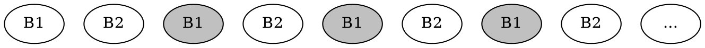

*Eviction policy* is how we determine which blocks to keep in memory if we run out of it

* $FIFO$: first in, first out
* $LRU$: least recently used
* $OPT$: "optimal" one that greedily removes the latest-to-be-used block
  (you need to able to predict the future to do that)

Hardware-defined for CPU caches, programmable for everything larger

Eviction policy is the method for deciding which data to retain in the cache. In CPUs, it is controlled by hardware, not software. For simplicity, programmer can assume that least recently used (LRU) policy is used, which just evicts the item that hasn’t been used for the longest amount of time. This is like preferring beer with later expiration dates.

$LRU_M \leq 2 \cdot OPT_{M/2}$

[Sleator & Tarjan '85]

<!-- .element: class="fragment" data-fragment-index="3" -->It doesnt affect complexity in most of the cases
So it doesn't really matter that much which eviction policy to use

----

### Sketch of a proof

$LRU_M \leq 2 \cdot OPT_{M/2}$

* Consider "worst case" scenario: repeating series of $\frac{M}{B}$ distinct blocks
* For $LRU$, each block is new and so it has 100% cache misses
* $OPT_{M/2}$ would be able to cache half of them and thus halve the time
* Anything better for $LRU$ would only strengthen this inequality

