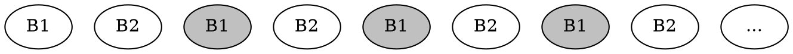

*Eviction policy* is how we determine which blocks to keep in memory if we run out of it

* $FIFO$: first in, first out
* $LRU$: least recently used
* $OPT$: "optimal" one that greedily removes the latest-to-be-used block
  (you need to able to predict the future to do that)

Hardware-defined for CPU caches, programmable for everything larger

Eviction policy is the method for deciding which data to retain in the cache. In CPUs, it is controlled by hardware, not software. For simplicity, programmer can assume that least recently used (LRU) policy is used, which just evicts the item that hasn’t been used for the longest amount of time. This is like preferring beer with later expiration dates.


$LRU_M \leq 2 \cdot OPT_{M/2}$

[Sleator & Tarjan '85]

<span><!-- .element: class="fragment" data-fragment-index="3" -->It doesnt affect complexity in most of the cases
So it doesn't really matter that much which eviction policy to use</span>

----

### Sketch of a proof

$LRU_M \leq 2 \cdot OPT_{M/2}$

* Consider "worst case" scenario: repeating series of $\frac{M}{B}$ distinct blocks
* For $LRU$, each block is new and so it has 100% cache misses
* $OPT_{M/2}$ would be able to cache half of them and thus halve the time
* Anything better for $LRU$ would only strengthen this inequality




Temporal locality is an access pattern where if at one point a particular item is requested, it is likely that this same location will be requested again in the near future. This is like fetching the same type of beer over and over again.

Spacial locality is an access pattern where if a memory location is requested, it is likely that a nearby memory locations will be requested again in the near future. This is like storing the kinds of beer that you like on the same shelf.

## Data Locality

* Temporal locality: it is likely that this same location will soon be requested again
* Spacial locality: it is likely that a nearby location will be requested right after

Abstracting away from how cache works helps a lot when designing algorithms

---

### Depth-First vs Breadth-First

* A lot of algorithms can be implemented in one of two ways
* Recursive: you would be able to fit smaller datasets into cache (temporal locality)
* Iterative: you would be able to do sequential i/o (spacial locality)

For example, you want to do divide-and-conquer depth-first most of the time

----

Consider the knapsack problem (in Python for simplicity):

```python
@lru_cache
def f(i, k):
    if i == n or k == 0:
        return 0
    if w[i] > k:
        return f(i + 1, k)
    return max(f(i + 1, k), c[i] + f(i + 1, k - w[i]))
```

The recursion is extremely slow not because its recursion,
but because it does random i/o throughout most of the execution

```cpp
int f[N+1][W+1];

for (int i = n - 1; i >= 0; i++)
    for (int k = 0; k <= W; k++)
        f[i][k] = (w[i] > k ? f[i+1][k] : max(f[i+1][k], c[i] + f[i+1][k-w[i]]));
```
<!-- .element: class="fragment" data-fragment-index="1" -->

Note that each layer is computed and then accessed exactly once right after
(you actually need $O(W)$ memory which could all fit into L1 cache)
<!-- .element: class="fragment" data-fragment-index="2" -->

---

### Array-of-Structs and Struct-of-Arrays

Suppose you build a binary tree and store it like this (SoA):

```
int left_child[maxn], right_child[maxn], key[maxn], size[maxn];
```

It it was stored like this (AoS), you would need ~4 times less block reads:

```
struct Data {
    int left_child, right_child, key, size;
};

Data data[maxn];
```

AoS is better for seaching, SoA is better for scanning

----

### Iteration Order Matters

* Sparse table is a *static* data structure for computing *idempotent reductions*
  (on subsegments of arrays, e. g. static RMQ)
* To build it, you need to compute the function for all power-of-two length segments
* You can do it in DP fashion by using already processed segments

```cpp
int mn[logn][maxn];

for (int l = 0; l < logn - 1; l++)
    for (int i = 0; i + (2 << l) <= n; i++)
        mn[l+1][i] = min(mn[l][i], mn[l][i + (1 << l)]);
```

There are a total of 2×2=4 ways to build it,
only one of them yields beautiful linear passes that work ~3x faster

---

## Cache-Efficient Algorithms

* Cache-aware: efficient with *known* $B$ and $M$
* Cache-oblivious: efficient for *any* $B$ and $M$

E. g. external merge sort is cache-aware, but not cache-oblivious

Cache-oblivious algorithms are cool because they are optimal for all memory levels

---


## Transposing matrices

Assume we have a square matrix $A$ of size $N \times N$.

Naive way to transpose it:

```cpp
for (int i = 0; i < n; i++)
    for (int j = 0; j < i; j++)
        swap(a[j][i], a[i][j])
```

I/O complexity is $O(N^2)$: writes are not sequential

(if you swap iteration variables it's going to be the same but for writes)

----

### Cache-oblivious algorithm

1. Divide the input matrix into 4 smaller matrices
2. Transpose each one recursively
3. Combine results by swapping corner result matrices
4. Stop until it fits into cache

$$\begin{pmatrix}
A & B \\
C & D
\end{pmatrix}^T=
\begin{pmatrix}
A^T & C^T \\
B^T & D^T
\end{pmatrix}
$$

Complexity: $O(\frac{N^2}{B})$. Pick something like 32x32 if you don't know cache size beforehand

----

Implementing D&C on matrices is a bit more complex than on arrays,
but the idea is the same: we want to use "virtual" matrices instead of copying them

```cpp
template<typename T>
struct Matrix {
    int x, y, n, N;
    T* data;
    T* operator[](int i) { return data + (x + i) * N + y; }
    Matrix<T> subset(int _x, int _y, int _n) { return {_n, _x, _y, N, data}; }

    Matrix<T> transpose() {
        if (n <= 32) {
            for (int i = 0; i < n; i++)
                for (int j = 0; j < i; j++)
                    swap((*this)[j][i], (*this)[i][j]);
        } else {
            auto A = subset(x, y, n / 2).transpose();
            auto B = subset(x + n / 2, y, n / 2).transpose();
            auto C = subset(x, y + n / 2, n / 2).transpose();
            auto D = subset(x + n / 2, y + n / 2, n / 2).transpose();
            for (int i = 0; i < n; i++)
                for (int j = 0; j < n; j++)
                    swap(B[i][j], C[i][j]);
        }

        return *this;
    }
};
```

Rectangular and non-power-of-two matrices is a homework 

---

## Matrix multiplication

$C_{ij} = \sum_k A_{ik} B_{kj}$

```cpp
// don't forget to initialize c[][] with zeroes
for (int i = 0; i < n; i++)
    for (int j = 0; j < n; j++)
        for (int k = 0; k < n; k++)
            c[i][j] += a[i][k] * b[k][j];
```

* Naive? <span>$O(N^3)$: each scalar multiplication needs a new block read <!-- .element: class="fragment" data-fragment-index="1" --></span>

* What if we transpose $B$ first? <span><!-- .element: class="fragment" data-fragment-index="2" --> $O(N^3/B + N^2)$</span>

```cpp
for (int i = 0; i < n; i++)
    for (int j = 0; j < i; j++)
        swap(b[j][i], b[i][j])
// ^ or use our faster transpose from before

for (int i = 0; i < n; i++)
    for (int j = 0; j < n; j++)
        for (int k = 0; k < n; k++)
            c[i][j] += a[i][k] * b[j][k]; // <- note the indices
```
<!-- .element: class="fragment" data-fragment-index="2" -->


<span><!-- .element: class="fragment" data-fragment-index="3" --> Can we do better?</span>

----

### Divide-and-Conquer

Essentially the same trick: divide data until it fits into lowest cache ($N^2 \leq M$)

$$\begin{pmatrix}
A_{11} & A_{12} \\
A_{21} & A_{22} \\
\end{pmatrix} \begin{pmatrix}
B_{11} & B_{12} \\
B_{21} & B_{22} \\
\end{pmatrix} = \begin{pmatrix}
A_{11} B_{11} + A_{12} B_{21} & A_{11} B_{12} + A_{12} B_{22}\\
A_{21} B_{11} + A_{22} B_{21} & A_{21} B_{12} + A_{22} B_{22}\\
\end{pmatrix}
$$

Arithmetic complexity is the same,
becase $T(N) = 8 \cdot T(N/2) + O(N^2)$ is solved by $T(N) = O(N^3)$

It doesn't seem like we "conquered" anything yet, but let's think about I/O complexity

$$T(N) = \begin{cases}
O(\frac{N^2}{B}) & N \leq \sqrt M & \text{(we only need to read it)} \\
8 \cdot T(N/2) + O(\frac{N^2}{B}) & \text{otherwise}
\end{cases}$$
<!-- .element: class="fragment" data-fragment-index="2" -->

Dominated by $O((\frac{N}{\sqrt M})^3)$ base cases, so total complexity is $T(N) = O\left(\frac{(\sqrt{M})^2}{B} \cdot (\frac{N}{\sqrt M})^3\right) = O(\frac{N^3}{B\sqrt{M}})$
<!-- .element: class="fragment" data-fragment-index="3" -->

----

## Strassen Algorithm*

<!-- .slide: id="strassen" -->
<style>
#strassen {
    font-size: 18px;
}
</style>

$$\begin{pmatrix}
C_{11} & C_{12} \\
C_{21} & C_{22} \\
\end{pmatrix}
=\begin{pmatrix}
A_{11} & A_{12} \\
A_{21} & A_{22} \\
\end{pmatrix}
\begin{pmatrix}
B_{11} & B_{12} \\
B_{21} & B_{22} \\
\end{pmatrix}
$$

Compute intermediate products of $\frac{N}{2} \times \frac{N}{2}$ matrices and combine them to get matrix $C$:

$$
\begin{align}
   M_1 &= (A_{11} + A_{22})(B_{11} + B_{22})   & C_{11} &= M_1 + M_4 - M_5 + M_7
\\ M_2 &= (A_{21} + A_{22}) B_{11}             & C_{12} &= M_3 + M_5
\\ M_3 &= A_{11} (B_{21} - B_{22})             & C_{21} &= M_2 + M_4
\\ M_4 &= A_{22} (B_{21} - B_{11})             & C_{22} &= M_1 - M_2 + M_3 + M_6
\\ M_5 &= (A_{11} + A_{12}) B_{22}
\\ M_6 &= (A_{21} - A_{11}) (B_{11} + B_{12})
\\ M_7 &= (A_{12} - A_{22}) (B_{21} + B_{22})
\end{align}
$$

We use only 7 multiplications instead of 8, so arithmetic complexity is $O(n^{\log_2 7}) \approx O(n^{2.81})$

----


As of 2020, current world record is $O(n^{2.3728596})$

