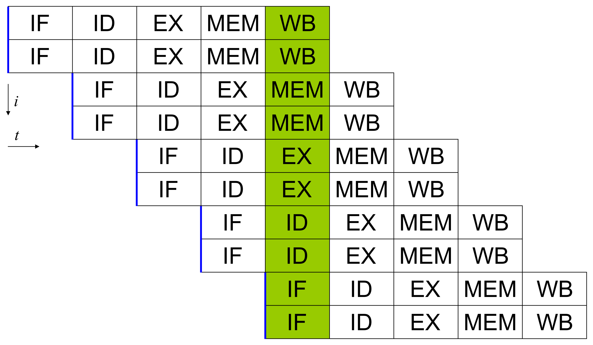

In the previous version, we have an inherently sequential chain of operations in the innermost loop. We accumulate the minimum in variable v by a sequence of min operations. There is no way to start the second operation before we know the result of the first operation; there is no room for parallelism here:

...
v = std::min(v, z0);
v = std::min(v, z1);
v = std::min(v, z2);
v = std::min(v, z3);
v = std::min(v, z4);
...
Independent operations
There is a simple way to reorganize the operations so that we have more room for parallelism. Instead of accumulating one minimum, we could accumulate two minimums, and at the very end combine them:

...
v0 = std::min(v0, z0);
v1 = std::min(v1, z1);
v0 = std::min(v0, z2);
v1 = std::min(v1, z3);
v0 = std::min(v0, z4);
...
v = std::min(v0, v1);
The result will be clearly the same, but we are calculating the operations in a different order. In essence, we split the work in two independent parts, calculating the minimum of odd elements and the minimum of even elements, and finally combining the results. If we calculate the odd minimum v0 and even minimum v1 in an interleaved manner, as shown above, we will have more opportunities for parallelism. For example, the 1st and 2nd operation could be calculated simultaneously in parallel (or they could be executed in a pipelined fashion in the same execution unit). Once these results are available, the 3rd and 4th operation could be calculated simultaneously in parallel, etc. We could potentially obtain a speedup of a factor of 2 here, and naturally the same idea could be extended to calculating e.g. 4 minimums in an interleaved fashion.

Instruction-level parallelism is automatic
Now that we know how to reorganize calculations so that there is potential for parallelism, we will need to know how to realize the potential. For example, if we have these two operations in the C++ code, how do we tell the computer that the operations can be safely executed in parallel?

v0 = std::min(v0, z0);
v1 = std::min(v1, z1);
The delightful answer is that it happens completely automatically, there is nothing we need to do (and nothing we can do)!

The magic takes place inside the CPU. The compiler just produces two machine language instructions, without any special annotation that indicates whether or not these instructions can be executed in parallel. The CPU will then automatically figure out which of the instructions can be executed in parallel.

A bit more precisely, the CPU will look at the instruction stream up to some distance in the future. If there are branches, it will do branch prediction to produce a sequential stream of instructions. Then it will see which of the instructions are ready for execution. For example, if it sees a future instruction X that only uses registers A and B, and there are no instructions before it that touch those registers, and none of the instructions that are currently in the pipeline modify those registers, either, then it is safe to start to execute X as soon as there is an execution unit that is available.

All of this happens in the hardware, all the time, fully automatically. The only thing that the programmer needs to do is to make sure there are sufficiently many independent instructions always available for execution.

### Instruction Pipelining

The same things applies to CPUs and other hardware. To increase the utilization, instructions are processed in a pipeline.

Modern processors don’t actually execute instructions one-by-one, but maintain a *pipeline* of pending instructions so that two independent operations can be executed concurrently without waiting for each other to finish.

When I said that `add` instruction only takes one cycle, I lied a little bit. Every instruction needs a bit more than that. The whole thing takes around 5-6 clock cycles. But still, when you use it, it appears and feels like a single instruction. How does CPU achieve that?

The thing is, most of CPU isn't about computing.

Although logically it takes fundamentally 3 cycles, in CPUs it is much more.

### An Education Metaphor

As a everyday metaphor, consider how a university works. It could have one student at a time and around 50 professors, which would take turns in tutoring, but this would be highly inefficient and result in one bachelor's degree every 4 year.

Maybe this is how the members of the British royal family study.

But for better of worse, the education is scaled.

Instead, universities do two smart things:

1. They teach to large groups of students at once instead of individuals.
2. They overlap their "classes" so that each can all professors keep busy. This way you can increase throughput by 4x.

For the first trick, the CPU world analogue is SIMD, which we covered in the previous chapter. And for the second, it is the technique called pipelining, which we are going to discuss next.

### Latency and Throughput

and adds a new level of complexity

Programming pipelined and superscalar processors presents its own challenges, which we are going to address in this chapter.

### Instruction Scheduling

superscalar processors

Out-of-order execution. A buffer of pending instructions.

uops, execution ports.

This is a bit of an advanced and not well understood topic.

Documentation is very obscure.

You know that your documentation is good when people have to reverse engineer it.

There are reasons to believe that folks at Intel don't know that themselves.

llvm-mca
