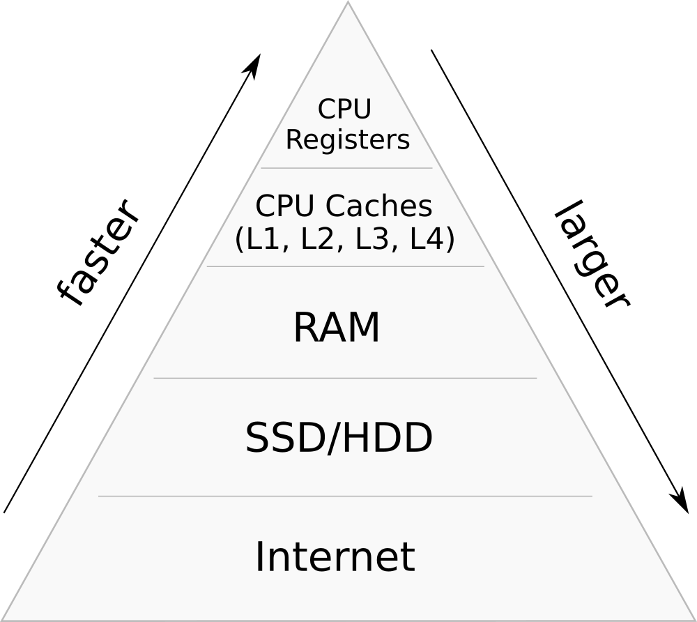
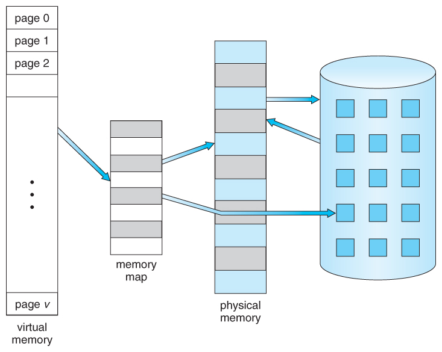

Consider what happens when you perform a `+` operation on variables stored somewhere in memory: 

```cpp
void add(int *a, int *b, int *c) {
    *c = *a + *b;
}
```

Processors can't perform instructions directly on memory-stored data; CPU always needs to fetch the operands first, that is, it reads a few raw bytes from specified memory locations into registers, calculates the results, and writes them back.

Here is the same code compiled to assembly (RISC-V):

```asm
add(int*, int*, int*): # a0=*a, a1=*b, a2=*c
    lw  a0, 0(a0)      # load 4 bytes from wherever a0 points into a0
    lw  a1, 0(a1)      # load 4 bytes from wherever a1 points into a1
    add a0, a0, a1     # add a0 and a1 and write the result into a0
    sw  a0, 0(a2)      # write contents of a0 to wherever a2 points
    ret
```

This whole read-modify-write process takes time—usually much longer than the time needed for the instruction itself. As a reason of why, consider the CPU and RAM on a motherboard of your laptop. To travel to one side of your laptop to the other one and back, for a round trip it probably needs somewhere on the order of a meter of distance. The speed of light is roughly $3 \cdot 10^8$ m/s, which means that it needs at least ${1 \over 3 \cdot 10^8} = 3.3$ ns, which is about 10 cycles on a typical 3GHz CPU.

Electricity is not a direct line speed is much [lower](https://en.wikipedia.org/wiki/Speed_of_electricity). It is about 1/100 times lower in electricity. Speed of electricity is lower than speed of light.

To mitigate this, CPU manufacturers introduced temporal storage spaces that are literally closer called caches.

## Memory Hierarchy

Modern computer memory is hierarchical. It consists of multiple cache layers of varying speed and size, where *upper* levels typically store most frequently accessed data from *lower* levels to reduce latency.



Each new level is usually an order of magnitude faster, but also smaller and/or more expensive.

Here is a famous analogy to caching:



Most programmers don't even need to think about this process as it is mostly abstracted away and happends behind the scenes. Often you aren't even able to control it directly: for example, you have almost no control of what is stored in CPU caches.

Reality is more complicated, so let's study it in more detail.

## Types of Memory

Here is where your data can be stored:

Here is a comparison table more or less actual for commodity 2021 hardware:

| Type | $M$      | $B$ | Latency | $/GB/mo* |
|:---- |:-------- | --- | ------- |:-------- |
| L1   | 10K      | 64B | 0.5ns   | -        |
| L2   | 100K     | 64B | 5ns     | -        |
| L3   | 1M/core  | 64B | 20ns    | -        |
| RAM  | GBs      | 64B | 100ns   | 1.5      |
| SSD  | TBs      | 4K  | 0.1ms   | 0.17     |
| HDD  | TBs      | -   | 10ms**  | 0.04     |
| S3   | $\infty$ | -   | 150ms   | 0.02***  |

Some notes:
- $M$ means the size.
- $B$ stands for size of the block. More on that later.
- Pricing is ammortized.

A huge distinction is between RAM and disk.

### Volatile Memory

- **CPU registers.** These are the data cells. Access time is zero. There is only a very limited nubmer of them (e. g. 16 "general purpose" ones). In some cases you may want to use all your available registers.
- **CPU caches.** Modern ones have multiple layers. As of now, most commodity CPUs have 3 layers of cache and high-end ones have 4. L1 cache may take 3-4 cycles. Lower layers are shared between cores and are usually scale with the number of them (e. g. 10-core CPU will have around 10M or L3 cache). They come with CPUs themselves.
- **Random access memory.** You can increase. It takes about 100 cycles to read from RAM. One thing to note is that RAM and CPU caches have a concept.

Cache line is the unit of data transfer between CPU and main memory. The cache line of your PC is most likely 64 bytes, meaning that the main memory is divided into blocks of 64 bytes, and whenever you request a byte, you are also fetching its cache line neighbours regardless whether your want it or not.

### Non-Volatile Memory

- **Solid state drives.** These have latency of 0.1ms ($10^5$ ns)
- **Hard disk drive.** These are complicated, because HDD is actually a rotating physical thing with weird access patterns. [Video](https://www.youtube.com/watch?v=3owqvmMf6No&feature=emb_title)
- **Network-attached storage.** Simplest ones are NFS.

### Pagination

You can easily map non-volatile memory to behave like the normal one. In fact, this is the way it is mostly used, because it provides a convenient interface to file system.

RAM caching is transparent, but you need to use bufferization when working with external memory (e. g. HDD) unless it is [memmap](https://en.wikipedia.org/wiki/Mmap)-ed

It is much nicer to perform operations like if they were in memory.

Last thing to note is that main memory also has pagination.



---

We haven't covered some nuances, like how to [decide](eviction-policies) which blocks to keep in memory and which to discard, or the fact that you can perform requests [simultaneously](bandwidth-latency), but it will do for now.
