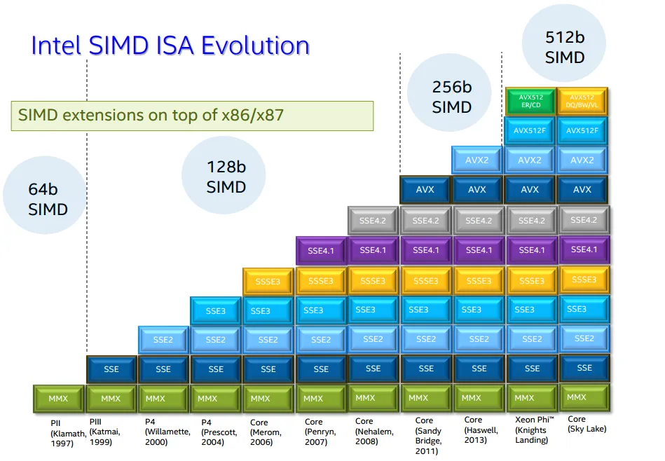

Consider the following program, in which we calculate the sum of an integer array:

```c++
const int n = 1e5;
int a[n], s = 0;

int main() {
    for (int t = 0; t < 100000; t++)
        for (int i = 0; i < n; i++)
            s += a[i];

    return 0;
}
```

If we compile it with plain `g++ -O3` and run, it will finish in 2.43 seconds.

Now, let's add the following magic directive in the very beginning:

```c++
#pragma GCC target("avx2")
// ...the rest is the same as before
```

When compiled and run in the exact same environment, it finishes in 1.24 seconds. This is almost twice as fast, and we did not change a single line of code or the optimization level.

What happened here is that we provided a little bit of info about the computer on which this code is supposed to be run. Specifically, we told the compiler that the target CPU supports an extension to x86 instruction set called "AVX2". AVX2 is one of the many "SIMD extensions" for x86. These extensions provide instructions that use special registers capable of holding 128, 256 or even 512 bits of data.


Unlike the basic x86 instructions that utilize 32- or 64-bit registers, these extensions follow the "single instruction, multiple data" approach (hence the name). Instead of working with single values (nobody really needs a 128-bit integer), SIMD instructions divide the data into blocks of 8, 16, 32, or 64 bits and perform the same operation in parallel, which yields a proportional[^power] increase in performance.

[^power]: They have been known to consume more power and lower clock rates.

These extensions are relatively new, and their support in CPUs has been added gradually while maintaining[^avx512] backwards compatibility. The most notable difference is the introduction

AVX2, in particular, has the instructions for working with 256-bit registers, while by default GCC assumes that nothing past 128-bit SSE2 is enabled. Hence, by telling the optimizer that it can use instructions that add 8 integers at a time instead of 4, the performance time was increased twofold.

[^avx512]: Some of them are absolete, and starting with avx512, it is much more specialized.



Compilers often do a good job rewriting simple loops with SIMD instructions. This is called *autovectorization*, and it is the preferred way to use SIMD. But it only works on certain types of loops and sometime yields suboptimal results, and to understand its limitations, we need to get our hands dirty and explore this technology on a lower level.
