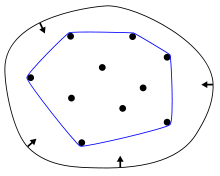

**Выпуклое множество** — такое множество точек, что, для любых двух точек множества, все точки на отрезке между ними тоже принадлежат этому множеству.

**Выпуклая оболочка** множества точек — такое выпуклое множество точек, что все точки фигуры также лежат в нем.

**Минимальная выпуклая оболочка** множества точек — это минимальная по площади выпуклая оболочка.

Для экономии времени дальше минимальные выпуклые оболочки мы будем называть просто выпуклыми оболочками.



Для практических целей выпуклые оболочки полезны тем, что они компактно хранят всю необходимую информацию о множестве точек, что позволяет быстро отвечать на разнообразные запросы на этом множестве.

Выпуклые оболочки можно рассматривать в любом пространстве, но в этой статье мы ограничимся двумерным и научимся их эффективно и строить по какому-то множеству из $n$ точек на плоскости и применять для ответов разнообразные на запросы об этом множестве.

---


## Выпуклый многоугольник

Пусть в многоугольнике $n$ вершин. Рассмотрим алгоритм за $O(\\log n)$.

Рассмотрим самую левую, а из таких самую нижнюю точку многоугольника -
$O$. Если наша точка $P$ лежит левее или ниже нее, то сразу можем
сказать, что она не принадлежит многоугольнику.

Проведем из $O$ диагонали ко всем вершинам многоугольника, получим, что
он разбит на треугольники, одновременно соседние диагонали образуют
последовательные углы. Давайте бинарным поиском найдем угол, в
котором лежит точка $P$. Если бинарный поиск попал в один из
крайних треугольников, то можно проверить руками, лежит ли точка
внутри угла (для этого достаточно рассмотреть три векторных
произведения), если это не так, то возвращаем FALSE.

После того как угол установлен, надо проверить принадлежность нужному
треугольнику. Можно, например, проверить, не лежит ли точка на одной
из сторон этого треугольника, если нет, то проверить принадлежность
точки одновременно любым двум из трех углов треугольника.

## Идея

Если зафиксировать какую-либо вершину, то относительно нее углы будут
расположены против часовой стрелки или против часовой стрелки, при
этом несложно заметить, что сначала угол к вершине будет
меньше/больше угла к нашей точке, а затем наоборот,
следовательно, мы можем сделать бинпоиск и найти первую вершину
угол от которой больше/меньше нашего.

## Код

``` C++
point zero;//какая-то точка, которую мы сохранили как 0, для того, чтобы определять по или против
//a = vector_angles;
point my = { q.y - zero.y, q.x - zero.x };
auto it = upper_bound (a.begin(), a.end(), my);
if (it == a.end() && my.a == a[n - 1].a && my.b == a[n - 1].b) {
    it = a.end() - 1;
}
if (it != a.end() && it != a.begin()) {
    int p1 = int(it - a.begin());
    if (in(p[p1], p[p1 - 1], q) <= 0) {//проверка то что внутри
    //внутри
    }
}
//нет
```

