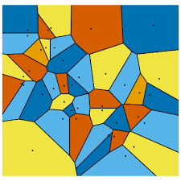

В математике, геометрические задачи в основном доказательные: обычно требуется показать, что угол $A$ равен углу $B$, или что такой-то отрезок во столько-то раз больше другого. В школе её используют для знакомства с основными принципами логики и отучивания от слова «очевидно».

В программировании (как и в реальной жизни) задачи совершенно другого плана: геометрия больше количественная, чем качественная, и применяется для оптимизации чего-то, для подсчета точных величин, или для выполнения зависящих от конкретных чисел проверок.

Для решения подобных задач есть два подхода: алгебраический и конструктивный. Когда математик говорит «пересечем две прямые», он представляет громоздкое уравнение, с которым он потом будет работать. Программист же хочет абстрагироваться и написать функцию `intersect(a, b)`, в корректности которой он точно уверен, которую он будет вызывать по необходимости, не беспокоясь об алгебраических выражениях. Это позволяет разбить задачу на много маленьких кусочков, которые можно решать по отдельности, а не возиться с формулами.

В этой главе мы рассмотрим как раз такой конструктивный подход к вычислительной геометрии и научимся манипулировать различными геометрическими объектами с помощью ООП в C++.
