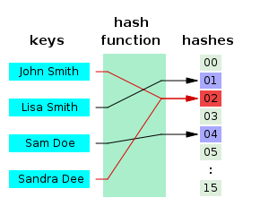

Хеш — это какая-то функция, сопоставляющая объектам какого-то множества числовые значения из ограниченного промежутка.

«Хорошая» хеш-функция:

* Быстро считается  — за линейное от размера объекта время;
* Имеет не очень большие значения — влезающие в 64 бита;
* «Детерминировано-случайная» — если хеш может принимать $n$ различных значений, то  вероятность того, что хеши от двух случайных объектов совпадут, равна примерно $\frac{1}{n}$.

Обычно хеш-функция не является взаимно однозначной: одному хешу может соответствовать много объектов. Такие функции называют *сюръективными*.

Для некоторых задач удобнее работать с хешами, чем с самими объектами. Пусть даны $n$ строк длины $m$, и нас просят $q$ раз проверять произвольные две на равенство. Вместо наивной проверки за $O(q \cdot n \cdot m)$, мы можем посчитать хеши всех строк, сохранить, и во время ответа на запрос сравнивать два числа, а не две строки.

### Применения в реальной жизни

- **Чек-суммы**. Простой и быстрый способ проверить целостность большого передаваемого файла — посчитать хеш-функцию на стороне отправителя и на стороне получателя и сравнить.
- **Хеш-таблица**. Класс `unordered_set` из STL можно реализовать так: заведём $n$ изначально пустых односвязных списков. Возьмем какую-нибудь хеш-функцию $f$ с областью значений $[0, n)$. При обработке `.insert(x)` мы будем добавлять элемент $x$ в $f(x)$-тый список. При ответе на `.find(x)` мы будем проверять, лежит ли $x$-тый элемент в $f(x)$-том списке. Благодаря «равномерности» хеш-функции, после $k$ добавлений ожидаемое количество сравнений будет равно $\frac{k}{n}$ = $O(1)$ при правильном выборе $n$.
- **Мемоизация**. В динамическом программировании нам иногда надо работать с состояниями, которые непонятно как кодировать, чтобы «разгладить» в массив. Пример: шахматные позиции. В таком случае нужно писать динамику рекурсивно и хранить подсчитанные значения в хеш-таблице, а для идентификации состояния использовать его хеш.
- **Проверка на изоморфизм**. Если нам нужно проверить, что какие-нибудь сложные структуры (например, деревья) совпадают, то мы можем придумать для них хеш-функцию и сравнивать их хеши аналогично примеру со строками.
- **Криптография**. Правильнее и безопаснее хранить хеши паролей в базе данных вместо самих паролей — хеш-функцию нельзя однозначно восстановить.
- **Поиск в многомерных пространствах**. Детерминированный поиск ближайшей точки среди $m$ точек в $n$-мерном пространстве быстро не решается. Однако можно придумать хеш-функцию, присваивающую [лежащим рядом](https://ru.wikipedia.org/wiki/Locality-sensitive_hashing) элементам одинаковые хеши, и делать поиск только среди элементов с тем же хешом, что у запроса.

Хешируемые объекты могут быть самыми разными: строки, изображения, графы, шахматные позиции, просто битовые файлы.

В этом разделе мы в основном сфокусируемся на строках.
