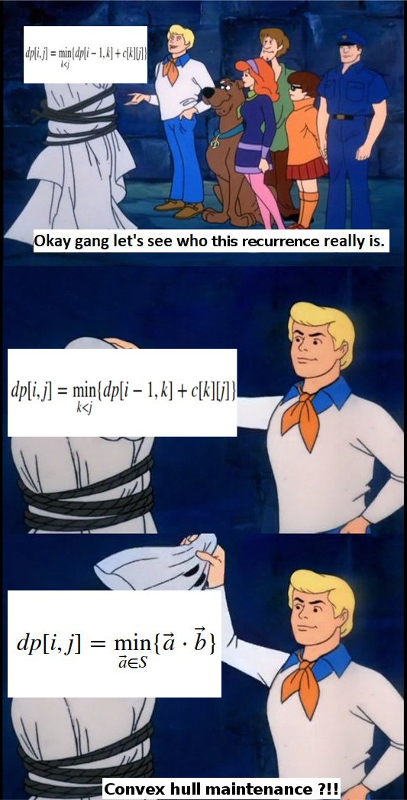

Возьмём исходную формулу для $f$ и раскроем скобки в `cost`:

$$
f[i, j] = \min_{k < i} \{ f[k, j-1] + (x_{i-1}-x_k)^2 \} = \min_{k < i} \{
f[k, j-1] + x_{i-1}^2
- 2x_{i-1} x_k
+ x_k^2
\}
$$

Заметим, что $x_{i-1}^2$ не зависит от $k$, значит его можно вынести. Под минимумом тогда останется

$$
\underbrace{f[k, j-1] + x_k^2}_{a_k}
\underbrace{-2x_k}_{b_k} x_{i-1}
$$

Это выражение можно переписать как $\min_k (a_k, b_k) \cdot (1, x_{i-1})$, где под «$\cdot$» имеется в виду скалярное произведение.



Пусть мы хотим найти оптимальное $k$ для $f[i][j]$. Представим все уже посчитанные релевантные динамики с предыдущего слоя как точки $(a_k, b_k)$ на плоскости. Чтобы эффективно находить среди них точку с минимальным скалярным произведением, можно поддерживать их *нижнюю огибающую* (вектор $(1, x_{i-1})$ «смотрит» всегда вверх, поэтому нам интересна только она) и просто бинпоиском будем находить оптимальную точку.

Хранить нижнюю огибающую можно просто в стеке. Так как добавляемые точки отсортированы по $x$, её построение будет занимать линейное время, а асимптотика всего алгоритму будет упираться в асимптотику бинарного поиска, то есть будет равна $O(n m \log n)$

```c++
struct line {
    int k, b;
    line() {}
    line(int a, int _b) { k = a, b = _b; }
    int get(int x) { return k * x + b; }
};

vector<line> lines; // храним прямые нижней огибающей
vector<int> dots; // храним x-координаты точек нижней огибающей
//     ^ первое правило вещественных чисел
//      считаем, что в dots лежит округленная вниз x-координата

int cross(line a, line b) { // считаем точку пересечения
                            // считаем a.k > b.k
    int x = (b.b - a.b) / (a.k - b.k);
    if (b.b < a.b) x--; // боремся с округлением у отрицательных чисел
    return x;
}


void add(line cur) {
    while (lines.size() && lines.back().get(dots.back()) > cur.get(dots.back())) {
        lines.pop_back();
        dots.pop_back();
    }
    if (lines.empty())
        dots.push_back(-inf);
    else 
        dots.push_back(cross(lines.back(), cur));
    lines.push_back(cur);
}

int get(int x) {
    int pos = lower_bound(dots.begin(), dots.end(), x) - dots.begin() - 1;
    return lines[pos].get(x);
}

```

В случае нашей конкретной задачи, алгоритм можно и дальше соптимизировать, если вспомнить, что $opt[i, j] \leq opt[i][j+1]$, то есть что оптимальная точка всегда будет «правее». Это позволяет вместо бинпоиска применить метод двух указателей:

```c++
// TODO: закомитьте кто-нибудь реализацию на гитхаб
```

Мы избавились от бинпоиска, и теперь алгоритм работает за $O(n \cdot m)$.

### Дерево Ли Шао

Существует другой подход к Convex Hull Trick: увидеть здесь не точки и оптимизацию скалярного произведения, а линии и нахождение минимума в точке среди этих линий.


Применительно к нашей задаче, выражение $\min_k (a_k, b_k) \cdot (1, x_{i-1})$ можно раскрыть как $\min_k (a_k + b_k \cdot x_{i-1})$ и представить как нахождение минимума в точке среди множества прямых вида $y = a_k + b_k \cdot x$.

*Дерево Ли Шао* (англ. *Li Chao segment tree*, кит. *李超段树*) — модификация дерева отрезков над множеством возможных $x$, каждая вершина которого хранит в себе такую прямую, что если пройти по пути от корня до соответствующего листа, то максимум в данной точке будет наибольшее значение на пути.


Пусть в вершину пришло обновление — прямая *new*. Если в ней ничего не хранится, то запишем *new* в вершину и выйдем. Если там уже есть какая-то другая прямая *old*, то одна из них будет «доминировать» над другой хотя бы на одной из половин, а в другой будет либо пересекаться, либо тоже доминировать.

Если одна прямая полностью доминирует над другой, то мы её просто запишем в вершину, а про вторую забудем. Если же прямая доминирует только в одной из половин, то мы запишем её, а «проигравшую» прямую передадим в рекурсию в ту половину, где она может доминировать.

```c++
typedef int ftype;
typedef complex<ftype> point;
#define x real
#define y imag

ftype dot(point a, point b) {
    return (conj(a) * b).x();
}

ftype f(point f, ftype x) {
    return dot(f, {x, 1});
}

const int inf = 1e6 + 42;

point ln[8 * inf];
void add_line(point nw, int v = 1, int l = -inf, int r = inf) {
    point ol = ln[v];
    int m = (l + r) / 2;
    bool lef = f(nw, l) > f(ol, l);
    bool mid = f(nw, m) > f(ol, m);
    ln[v] = mid ? nw : ol;
    if(r - l == 1)
        return;
    if(lef != mid)
        add_line(mid ? ol : nw, 2 * v, l, m);
    else
        add_line(mid ? ol : nw, 2 * v + 1, m, r);
}

int get(int x, int v = 1, int l = -inf, int r = inf) {
    if(r - l == 1)
        return f(ln[v], x);
    int m = (l + r) / 2;
    if(x < m)
        return max(f(ln[v], x), get(x, 2 * v, l, m));
    else
        return max(f(ln[v], x), get(x, 2 * v + 1, m, r));
}
```

Достаточно полезно сравнить между собой CHT и дерево Ли-Шао и понимать, в какой из ситуаций стоит применять каждую из этих структур. Адекватные реализации CHT требуют особых условий — точки должны быть отсортированы по $x$. Если это выполнено, то работать алгоритм будет значительно быстрее, чем дерево Ли Шао, которое, в свою очередь, решает более общую задачу, но работает за $O(\log MAXC)$ на запрос, а зачастую еще и требует неявную реализацию, если $MAXC$ достаточно большое (неявная реализация схожа с [неявным деревом отрезков](segtree)).
