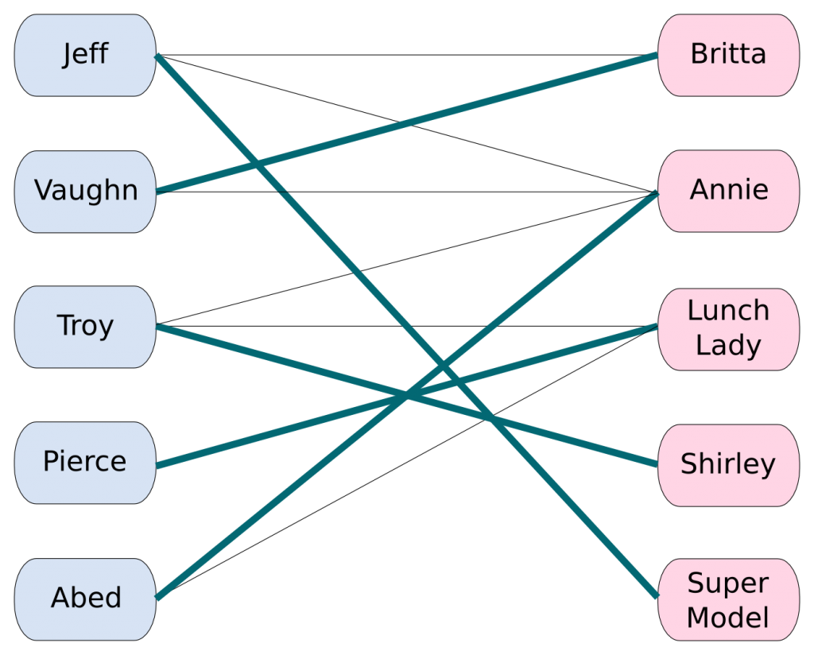

**Задача.** Пусть есть $n$ мальчиков и $m$ девочек. Про каждого мальчика и про каждую девочку известно, с кем они не против танцевать. Нужно составить как можно больше пар, в которых партнёры хотят танцевать друг с другом.

Формализуем эту задачу, представив мальчиков и девочек как вершины в двудольном графе, рёбрами которого будет отношение «могут танцевать вместе». Будем в дальнейшем обозначать левую долю графа как $L$, а правую долю как $R$.

**Паросочетанием** $M$ называется набор попарно несмежных рёбер графа (иными словами, любой вершине графа должно быть инцидентно не более одного ребра из $M$).

Все вершины, у которых есть смежное ребро из паросочетания (т.е. которые имеют степень ровно один в подграфе, образованном $M$), назовём *насыщенными* этим паросочетанием.

*Мощностью* паросочетания назовём количество рёбер в нём. *Наибольшим* (*максимальным*) паросочетанием назовём паросочетание, мощность которого максимальна среди всех возможных паросочетаний в данном графе, а *совершенным* — где все вершины левой доли им насыщенны.

Паросочетания [можно искать](http://e-maxx.ru/algo/matching_edmonds) не только в двудольных графах, однако общий алгоритм неприятно кодить, и он работает за $O(n^3)$, так что в этой главе мы сфокусируемся только на двудольных графах.
