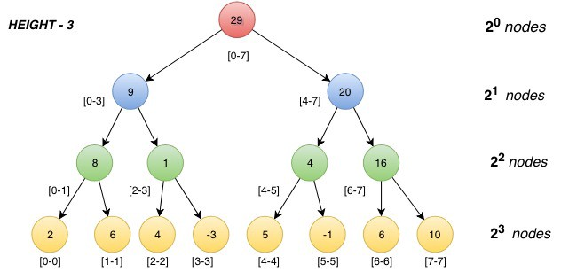

**Дерево отрезков** — очень мощная и гибкая структура данных, позволяющая быстро отвечать на самые разные запросы на отрезках.

Рассмотрим конкретную задачу: дан массив $a$ из $n$ целых чисел, и требуется отвечать на запросы двух типов:

1. Изменить значение в ячейке (т. е. реагировать на присвоение `a[k] = x`).
2. Вывести сумму элементов $a_i$ на отрезке с $l$ по $r$.

Оба запроса нужно обрабатывать за время $O(\log n)$.

### Структура дерева отрезков

Чтобы решить задачу, сделаем с исходным массивом следующие манипуляции.

Посчитаем сумму всего массива и где-нибудь запишем. Потом разделим его пополам, посчитаем сумму на половинах и тоже где-нибудь запишем. Каждую половину потом разделим пополам ещё раз, и так далее, пока не придём к отрезкам длины 1.

Эту последовательность разбиений можно представить в виде дерева.

Корень этого дерева соответствует отрезку $[0, n)$, а каждая вершина (не считая листьев) имеет ровно двух сыновей, которые тоже соответствуют каким-то отрезкам. Отсюда и название — «дерево отрезков».

### Разные полезные свойства

Высота дерева отрезков равна $\Theta(\log n)$: на каждом новом уровне длина отрезка уменьшается вдвое. Этот факт будет ключевым для оценки асимптотики операций.

Любой полуинтервал разбивается на $O(\log n)$ неперекрывающихся полуинтервалов, соответствующих в вершинам дерева: с каждого уровня нам достаточно не более двух отрезков.

Дерево содержит менее $2n$ вершин: первый уровень дерева отрезков содержит одну вершину (корень), второй уровень — в худшем случае две вершины, на третьем уровне в худшем случае будет четыре вершины, и так далее, пока число вершин не достигнет $n$. Таким образом, число вершин в худшем случае оценивается суммой $n + \frac{n}{2} + \frac{n}{4} + \frac{n}{8} + \ldots + 1 < 2n$. Значит, оно линейное по памяти.

При $n$, отличных от степеней двойки, не все уровни дерева отрезков будут полностью заполнены. Например, при $n=3$ левый сын корня есть отрезок $[0, 2)$, имеющий двух потомков, в то время как правый сын корня — отрезок $[2, 3)$, являющийся листом.

### Ок, как это нам поможет?

Опишем, как с помощью такой структуры решить исходную задачу.

**Запрос обновления**. Нам нужно обновить значения в вершинах таким образом, чтобы они соответствовали новому значению $a[k] = x$.

Изменим все вершины, в суммах которых участвует $k$-тый элемент. Их будет $\Theta(\log n)$ — по одной с каждого уровня.

Это можно реализовать как рекурсивную функцию: ей передаётся текущая вершина дерева отрезков, и функция выполняет рекурсивный вызов от одного из двух своих сыновей (от того, который содержит $k$-ый элемент в своём отрезке), а после этого — пересчитывает значение суммы в текущей вершине точно таким же образом, как мы это делали при построении дерева отрезков.

**Запрос суммы**. Мы знаем, что во всех вершинах лежат корректные значения, и нам с помощью них посчитать сумму на отрезке.

Сделаем тоже рекурсивную функцию, рассмотрев три случая:

1. Если отрезок вершины лежит целиком в отрезке запроса, то вернуть записанную в ней сумму.
2. Если отрезки вершины и запроса не пересекаются, то вернуть 0.
3. Иначе разделиться рекурсивно на 2 половины и вернуть сумму этой функции от обоих детей.

Чтобы разобраться, почему это работает за $O(\log n)$, нужно оценить количество «интересных» отрезков — тех, которые порождают новые вызовы рекурсии. Это будут только те, которые содержат границу запросов — остальные сразу завершатся. Обе границы отрезка содержатся в $O(\log n)$ отрезках, а значит и итоговая асимптотика будет такая же.

---

Дерево отрезков можно использовать для гораздо большего, чем только для суммы.

Далее этой главе мы рассмотрим разные реализации и варианты этой структуры и их применения.
