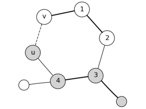

Рассмотрим следующую задачу:

> Авиакомпания содержит $m$ рейсов между $n$ городами, $i$-ый из них обходится в $w_i$ рублей, причём из любого города можно добраться до любого другого. В стране наступил кризис, и нужно отказаться от как можно большего числа из них таким образом, что содержание оставшиъся рейсов будет наиболее дешевым.

Иными словами, нужно найти дерево минимального веса, которое является подграфом данного неориентированного графа. Такие деревья называют *остовами* (*каркас*, *скелет*; ударение на первый слог, но так мало кто произносит). По-английски — *minimum spanning tree* (дословно, минимальное покрывающее дерево).

Почему дерево? Потому что в противном случае там был бы цикл, из которого можно удалить какое-то ребро и получить более оптималный ответ. А если это больше, чем одно дерево, то какие-то две вершины остаются несвязны.

Вообще, следующие утверждения про деревья являются эквивалентными:

- Граф — дерево.
- В графе из $n$ вершин есть $n-1$ рёбер и нет циклов.
- Из любой вершины можно дойти в любую другую единственным образом.

## Лемма о безопасном ребре

Назовем подграф $T$ графа $G$ *безопасным*, если они является подграфом какого-то минимального остова.

Назовем ребро безопасным, если при добавлении его в подграф $T$ получившийся подграф $T'$ тоже является безопасным, то есть подграфом какого-то минимального остова.

Все алгоритмы для поиска минимального остова опираются на следующее утверждение:

**Лемма о безопасном ребре.** Рассмотрим произвольный разрез (удалили некоторые рёбра так, что граф распался на две части) какого-то подграфа минимального остова. Тогда ребро минимального веса, пересекающее этот разрез (то есть соединяющее их при добавлении) является безопасным.

**Доказательство:** Рассмотрим какой-то минимальный остов, в котором этого ребра нет. Если его добавить, то образуется цикл, из которого можно выкинуть ребро не меньшего веса, получив ответ точно не хуже. Противоречие.

Получается, что мы можем действовать жадно — на каждом шаге добавлять ребро минимального веса, которое увеличивает наш остов.

## Полезные свойства и классические задачи

- Если веса всех рёбер различны, то остов будет уникален.
- Минимальный остов является также и остовом с минимальным произведением весов рёбер (замените веса всех рёбер на их логарифмы)
- Минимальный остов является также и остовом с минимальным весом самого тяжелого ребра.
- Если вы решаете задачу, где ребра не добавляются, а удаляются, и нужно поддерживать минимальный остов, то можно попробовать решать задачу «с конца» и применить алгоритм Крускала.
- Алгоритм Крускала — частный случай [алгоритма Радо-Эдмондса](matroid).
