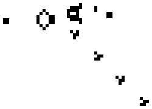

Автоматы — абстрактные математические объекты, как-то реагирующие на некоторые *события*, или *символы*.

Автомат определяется начальным состоянием, множеством возможных состояний, множеством символов, а также функцией, которая по паре из текущего состояния и символа определяет, в какое новое состояние должен переходить автомат.

Автоматы могут описывать много различных процессов и вычислений. Например, компьютер сам по себе является частным случаем реализации автомата: состоянием является содержимое оперативной памяти и регистров, событиями — взаимодействие с пользователем, правилами перехода — архитектура.

Другим примером являются клеточные автоматы, возможно знакомые читателю по [игре «Жизнь»](https://ru.wikipedia.org/wiki/%D0%98%D0%B3%D1%80%D0%B0_%C2%AB%D0%96%D0%B8%D0%B7%D0%BD%D1%8C%C2%BB) Джона Конвея. В ней состояние и правила переходов автомата определяется состоянием каждой индивидуальной клетки, так, что правила применяются сразу ко всей решетке.

В этом разделе мы рассмотрим конкретные применения автоматов в контексте строковых задач.
